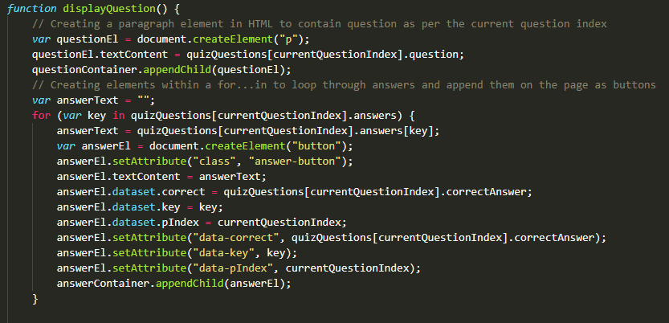
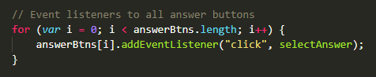
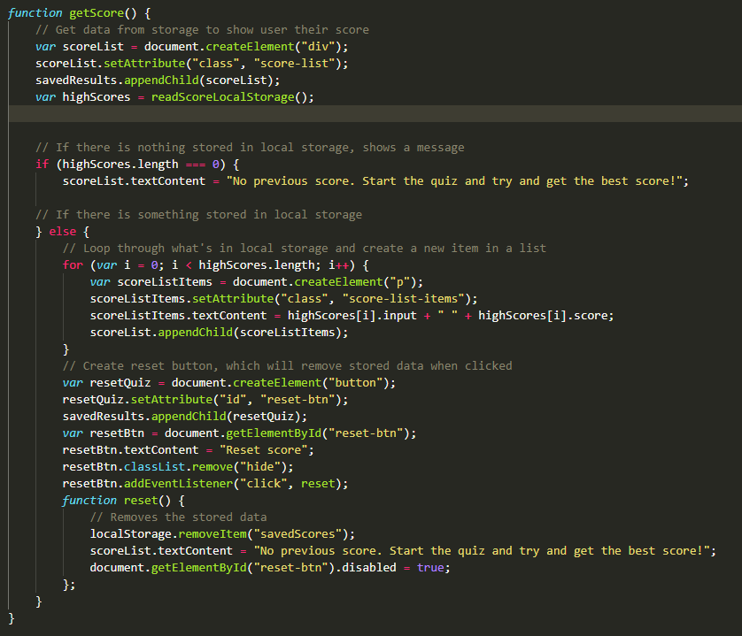

# JavaScript-fundamentals-code-quiz

## About the project

This project required the creation of a JavaScript code quiz. There was no starter code for this, so the project had to be created from scratch--all the HTML, CSS and JavaScript.

> The final project can be found at: https://chardige.github.io/JavaScript-fundamentals-code-quiz/

> The final HTML, CSS and JavaScript can be found at: https://github.com/CharDige/JavaScript-fundamentals-code-quiz

## User story

```
AS A coding boot camp student
I WANT to take a timed quiz on JavaScript fundamentals that stores high scores
SO THAT I can gauge my progress compared to my peers
```

## Acceptance criteria

```
GIVEN I am taking a code quiz
WHEN I click the start button
THEN a timer starts and I am presented with a question
WHEN I answer a question
THEN I am presented with another question
WHEN I answer a question incorrectly
THEN time is subtracted from the clock
WHEN all questions are answered or the timer reaches 0
THEN the game is over
WHEN the game is over
THEN I can save my initials and my score
```

## Technologies used
- HTML
- CSS
- JavaScript

## The process -- how I overcame challenges

### Small steps

I knew from the beginning that this would be challenging for me. I was comfortable with most of the JavaScript I had learned, but there were a few areas that I still wasn't sure on or hadn't come across yet. When breaking down the acceptance criteria, it was very overwhelming at first. However, I took the time to break up the steps into even smaller steps, ensuring I could track my progress.

By doing this, it really helped me in identifying exactly what issues I was facing so that when I needed to do extra research or reach out for help, I knew exactly what I needed to search for or ask assistance on.

Here are some steps I took that highlight my small steps:

1. Initial testing of the generate quiz function using console logs, then adding in the timer, which I tested through the console log as well
2. Focussed on the functionality to display the quiz through a `displayQuestion` function. I added two questions to test the process, so I could incorporate the `for...in` loop and test it.
3. Added in functions around selecting answers and displaying the next question, making minor adjustments so that when I got the function to work, I could add another aspect. For example, getting the next question and answers to show first, then adjusting the code to remove the previous question and answers.
4. Once a function worked, I would move to the next function, map out what I needed it to achieve, and then test it. In most cases, I needed to adjust other code or rearrange it. I knew minor bugs were popping up, but I left fixing these till the end.
5. Once I got to the final parts, I identified the little bugs that were popping up and spent time researching to find solutions as well as reaching out for help.
6. Once the functionality was all fixed and working as it needed to, I then spent the time on my CSS file, going through each step slowly to ensure the styles worked with the functionality and were responsive.

## Final


> The final project can be found at: https://chardige.github.io/JavaScript-fundamentals-code-quiz/

> The final HTML, CSS and JavaScript can be found at: https://github.com/CharDige/JavaScript-fundamentals-code-quiz

## Challenges

As mentioned in the process section, this was by far the most challenging project so far. Below is a list of the challenges I faced, which I'm proud to have overcome through many hours of research:

- Understanding how `for...in` loops work to display items within objects, and then understanding how to use these loops to display an array within an object while also allocating them with specific data so they could be distinguished between a correct answer and an incorrect answer.
- Using local storage within a conditional statement so that an alert would pop up, and then ensuring that closing the alert would take the user back to the right place.
- The process of storing objects within local storage and then getting each individual item within the storage and displaying them as a list.
- Disabling a button that only gets appended later in the function, so finding a way to avoid an error until that point.
- Using a `for` loop so multiple answer buttons on the same event listener would have different results depending on if the answer was correct or incorrect.

Below are some pieces of code which show how I overcame these challenges:

`for...in` loop to go through questions and answers within an object



`for` loop for answer buttons



Using a conditional statement and a `for` loop to get the items out of the local storage and display them in a list




## What I learnt
 
I learnt a lot throughout this assignment, and I've become a lot more confident in applying JavaScript. From pulling information out of local storage as an object and using JSON to change how it is displayed, to having conditional statements within conditional statements, there are a lot of handy skills I will now be able to apply with a lot more confidence than when I did prior to this assignment.

## Credits
 
I referred to a lot of websites throughout this assignment. I have provided references to these pages below:

W3 Schools (2022), *CSS cursor Property*, W3 Schools, https://www.w3schools.com/cssref/pr_class_cursor.asp

W3 Schools (2022), *How TO - Add a Class*, W3 Schools, https://www.w3schools.com/howto/howto_js_add_class.asp

W3 Schools (2022), *How TO - Remove a Class*, W3 Schools, https://www.w3schools.com/howto/howto_js_remove_class.asp

W3 Schools (2022), *HTML DOM Element setAttribute()*, W3 Schools, https://www.w3schools.com/jsref/met_element_setattribute.asp

Mozilla Contributors (2022), *Object*, mdn web docs, https://developer.mozilla.org/en-US/docs/Web/JavaScript/Reference/Global_Objects/Object

Mozilla Contributors (2022), *Array*, mdn web docs, https://developer.mozilla.org/en-US/docs/Web/JavaScript/Reference/Global_Objects/Array

Mozilla Contributors (2022), *for...in*, mdn web docs, https://developer.mozilla.org/en-US/docs/Web/JavaScript/Reference/Statements/for...in

W3 Schools (2022), *JavaScript For In*, W3 Schools, https://www.w3schools.com/js/js_loop_forin.asp

W3 Schools (2022), *HTML Input Types*, W3 Schools, https://www.w3schools.com/html/html_form_input_types.asp

W3 Schools (2022), *HTML `<input>` Tag*, W3 Schools, https://www.w3schools.com/tags/tag_input.asp

W3 Schools (2022), *Button disabled Property*, W3 Schools, https://www.w3schools.com/jsref/prop_pushbutton_disabled.asp

W3 Schools (2022), *Storage removeItem() Method*, W3 Schools, https://www.w3schools.com/jsref/met_storage_removeitem.asp

DelftStack (2022, January 29), *Remove All Child Elements Using JavaScript*, DelftSchools, https://www.delftstack.com/howto/javascript/remove-all-child-elements-using-javascript/#remove-all-child-elements-using-javascript

W3 Schools (2022), *HTML DOM Element removeChild()*, W3 Schools, https://www.w3schools.com/jsref/met_node_removechild.asp

## License

[MIT License Copyright (C) 2022 Charlotte Dige](./LICENSE)